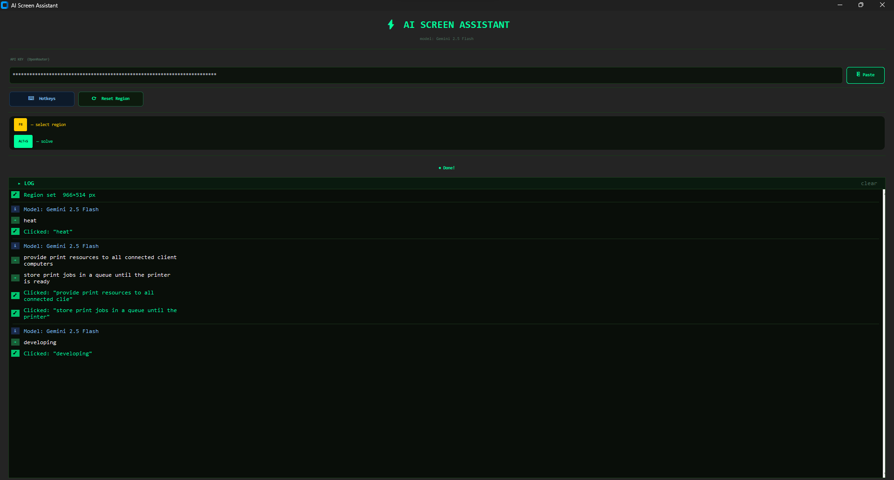

# ⚡ AI Screen Assistant
## Preview



A lightweight Windows desktop tool that captures any region of your screen,
extracts text with OCR, sends it to **Gemini 2.5 Flash** via
[OpenRouter](https://openrouter.ai), and automatically clicks the correct
answer on screen.

Designed for multiple-choice and matching questions displayed in any
application — browser-based tests, desktop LMS, certification practice tools,
etc.

---

## Features

| Feature | Details |
|---|---|
| **Screen capture** | Drag to select any region (F8) |
| **OCR** | Tesseract — reads text from the screenshot |
| **AI solving** | Gemini 2.5 Flash via OpenRouter API |
| **Auto-click** | Clicks the correct answer option on screen |
| **Answer popup** | Floating overlay shows answers with auto-dismiss timer |
| **Configurable hotkeys** | Remap F8 / CTRL+SHIFT+S from inside the app |
| **Persistent settings** | API key and hotkeys saved to `~/.ai_assistant_settings.json` |
| **Dark / neon UI** | CustomTkinter, fully dark theme |

---

## Requirements

- **Python 3.11+**
- **Windows** (tested on Windows 10/11; Linux/macOS untested)
- **Tesseract OCR** installed — [download here](https://github.com/UB-Mannheim/tesseract/wiki)
- An **OpenRouter API key** — [get one here](https://openrouter.ai/keys)

---

## Installation

### 1 — Clone the repo

```bash
git clone https://github.com/delniel/ai-screen-assistant.git
cd ai-screen-assistant
```

### 2 — Create a virtual environment (recommended)

```bash
python -m venv .venv
.venv\Scripts\activate      # Windows
```

### 3 — Install dependencies

```bash
pip install -r requirements.txt
```

### 4 — Install Tesseract

Download and install the Windows binary from:
<https://github.com/UB-Mannheim/tesseract/wiki>

Default install path: `C:\Program Files\Tesseract-OCR\tesseract.exe`

If you install to a different location, set the environment variable:

```powershell
$env:TESSERACT_PATH = "C:\Your\Custom\Path\tesseract.exe"
```

Or add it permanently via System Properties → Environment Variables.

### 5 — Run

```bash
python main.py
```

---

## Usage

1. **Paste your OpenRouter API key** into the key field (or use the ⎘ Paste button).
2. **Press F8** and drag a rectangle around the question + answer options on screen.
3. **Press CTRL+SHIFT+S** — the app will OCR the region, query the AI, and click
   the correct answer automatically.
4. An **answer popup** appears in the top-right corner for 9 seconds showing
   what was selected.

### Hotkeys

| Hotkey | Action |
|---|---|
| `F8` | Drag-select capture region |
| `CTRL+SHIFT+S` | Capture + solve |

Hotkeys can be remapped via the **⌨ Hotkeys** button in the UI.

---

## Configuration

Settings are saved automatically to:

```
~/.ai_assistant_settings.json
```

```json
{
  "hotkeys": {
    "select_region": "f8",
    "solve": "ctrl+shift+s"
  },
  "api_key": ""
}
```

> **Security note:** Your API key is stored in plain text in this local file.
> Do not commit it to version control. The file is in your home directory and
> is not included in this repository.

---

## Project structure

```
ai-screen-assistant/
├── main.py            # Single-file application
├── requirements.txt   # Python dependencies
└── README.md          # This file
```

---

## Troubleshooting

| Problem | Fix |
|---|---|
| `Tesseract not found` warning | Install Tesseract and/or set `TESSERACT_PATH` |
| `Invalid API key` | Check your key at openrouter.ai/keys |
| `No credits` | Top up your OpenRouter balance |
| `Rate limited` | Wait a few seconds and retry |
| Answer not clicked | Zoom out / increase region size so OCR reads text clearly |
| Hotkeys don't fire | Run the app as Administrator (keyboard lib needs elevated access on some systems) |

---

## License

MIT — do whatever you like, no warranty provided.
